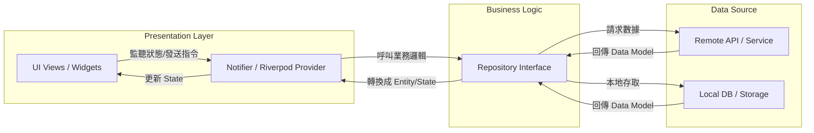

# Tec App

## Introduction
此份實作包含了下列核心功能：
- **選擇城市**：支援手動選擇城市。
- **智慧定位**：自動辨識距離用戶最近的城市。
- **進階篩選**：搜尋會議室支援日期、時間、人數、會議中心及視訊設備過濾。
- **可用性顯示**：即時顯示符合條件的可用會議室。

## Development Environment
- **OS**: MacOS Sequoia 15.7.3 (Chip Apple M2 Pro)
- **IDE**: Xcode 16.3
- **Flutter**: 3.27.3
- **Dart**: 3.6.1

## Testing Environment
- **Simulator**: iPhone 15 Pro, iOS 17.5 (Simulator version 16.0)
- **Physical Device**: iPhone 12, iOS 18.3.2

## Setup Instructions
執行下列指令即可運行專案：
```bash
flutter clean 
flutter pub get
flutter run
```
---

## Architecture
本專案採用 **Feature-first (Horizontal Layering)** 架構結合 **MVVM** 模式，以遵循Clean Architecture。
```
lib/
├── core/                               # 核心層：全域共用的基礎設施與配置
│   ├── extensions/                     # 擴充方法 (針對 String, Localization 的便捷操作)
│   ├── network/                        # 網路層 (API Client 封裝與配置)
│   ├── router/                         # 路由管理 (GoRouter 路由表設定)
│   ├── services/                       # 基礎服務 (如 Location Service 定位服務)
│   ├── storage/                        # 本地儲存 (Local Storage Provider 實作)
│   └── theme/                          # UI 主題 (AppColors, Theme Data 全域樣式)
│
├── features/                           # 業務功能層 (Feature-First 架構，)
│   ├── coworking/                      
│   │   └── presentation/              
│   │
│   ├── day_office/                     
│   │   └── presentation/              
│   │
│   ├── event_space/                    
│   │   └── presentation/               
│   │
│   ├── home/                           # 首頁模組 (包含地圖與底部導航邏輯)
│   │   ├── domain/                     # 領域層：Tab 項目實體定義
│   │   └── presentation/               # 表現層：主頁面與導航邏輯
│   │
│   ├── meeting_room/                   # 會議室預約模組 
│   │   ├── data/                       # 資料層：API 實作 (Remote Source) 與資料模型 (Models)
│   │   ├── domain/                     # 領域層：業務實體 (Entities) 與介面定義 (Repositories)
│   │   └── presentation/               # 表現層：狀態管理 (Riverpod Providers), 頁面 (Views), 專用元件 (Widgets)
│   │
│   └── splash/                         # 啟動頁模組
│       └── presentation/               # 表現層：啟動畫面 (Splash Screen)
│
├── l10n/                               # 多國語言層 (ARB 翻譯檔)
│
├── shared/                             # 全域共享層 (跨 Feature 共用的元件)
│   └── widgets/                        # 共用 UI 元件 (如 MeasureSize, TabSheetChild 等工具型 Widget)
│
└── main.dart                           # 程式入口：App 初始化與執行
```


### Data Filtering

因為這次專案只有用到部分JSON field，我在Data Layer的DTO(Data Transfer Object)只做我所要的field，並轉換成Domian Layer裡的Entity，兩邊field是一樣的，用於示範數據過濾的技術與概念。

- **Data Layer (DTO)**：針對 API 回傳的多個欄位，DTO 僅選取業務所需欄位進行解析。
- **Domain Layer (Entity)**：將 DTO 轉化為乾淨的 Entity 供 UI 層使用。


---

## Improvements
根據我使用實際「MyTEC」App 時所觀察的，以及我認為可以增進效能與用戶體驗，我在本專案中實作了以下優化：

### 效能與存取
- **圖片快取 (Cache)**：使用 `cached_network_image`，避免重複下載相同資源，節省用戶流量提升載入速度。
- **本地儲存 (Persistence)**：利用 `shared_preferences` 儲存用戶選擇的城市，App啟動後的讀取體驗。

### 邏輯調整
- **即時錯誤回饋**：在實際APP的操作下，用戶可以設置過去時間，在按下Apply時才會顯示錯誤訊息。在我的版本中，只要設置過去時間就馬上顯示錯誤訊息，以跟其他時間條件顯示邏輯一致。
- **Reset 按鈕機制優化**：
    在實際APP中的設計是：按下Reset後馬上，背景就馬上Fetch API，無法恢復原本篩選條件。
    1. **避免誤觸**：按下Reset後須點擊Apply才會正式生效，防止因誤觸而消失。
    2. **操作彈性**：按下Close即可恢復原本設定，無需重新選擇。
    3. **時效校驗**：Reset當下會再次觸發時間校驗，確保不會因靜置過久而搜尋到過時的時段。

### UI/UX 優化
- **點擊範圍優化**：針對實際App部分按鈕觸發區過小導致反應遲鈍的問題，使用符合Material Design 3 的按鈕大小。
- **Safe Area 適配**：實際App有些按鈕已很靠近iOS Home Indicator，防止系統誤觸並提升單手握持時的點擊便利性。
- **多國語言細節 (i18n)**：實際App在顯示人數篩選條件時，當人數是1時，會顯示1 Seats，而不是 1 Seat。在我的版本中，透過 `l10n` 自動處理單複數邏輯。例如：`1 Seat` (單數) vs `2 Seats` (複數)。
- **Centre清單顯示方式**：實際App顯示Centres是會截斷超過尺寸的字，但以台北為例，有些Centres前名稱是一樣的，無法辨別是哪一個中心。我改用清單顯示完整名稱，請參考下圖。
  


- **動態高度的篩選標籤顯示** : 在實際的APP中，底部的篩選標籤高度看起來是靜態的，所以會有部分內容被切除。我設計成動態調整，可以隨裝置解析度、標籤數量自動調整高度，以顯示所有標籤資訊


---

## Assumptions
我考慮Happy path跟我所能想到的edge case，排除極端或特殊情境（例如：網路沒開），在正常使用下，應能滿足操作。

## Limitations
- **請在 iOS 設備或模擬器上進行操作**，以確保所有功能運作正常。  
- 由於**Get Centre API**唯一支援的query parameter是id，不像**Get Room Info API**有支援`cityCode`，所以我的做法是取得求的資料，在Client端再篩選。  
- 部分**Get Room Info API**回傳的`centreCode`是有重複的，看起來是測試資料，這會造成在特定篩選條件下，造成部分篩選問題。
